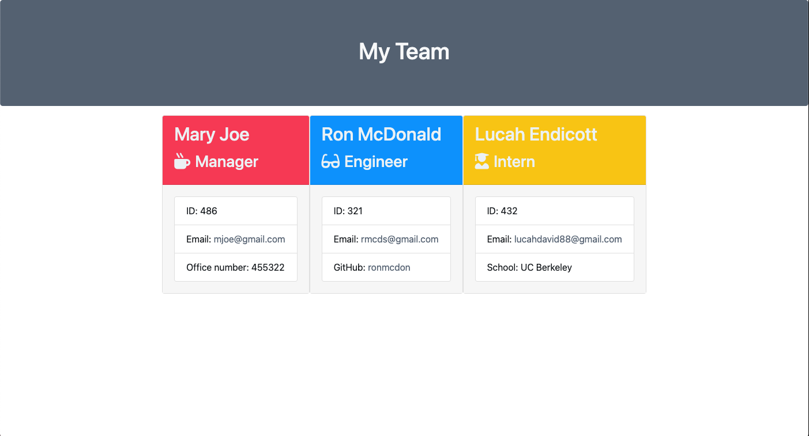

   
# Employee Template Engine  

## Description  
Node environment application that allows the user to input their employee's summary information to be displayed on a team webpage. ie. "job title, email, Github etc."    

## Table of Contents  
* [Installation](#installation)  
* [Usage](#usage)  
* [Credits](#credits)  
* [License](#license)  
* [Testing](#testing)  
* [Questions](#questions)  

## Installation  
Clone this repo to your local device. Run "npm install" in the terminal to install the node modules required to run the program. Once modules are installed run "node app.js" in the terminal to initiate the program.  

## Usage  
Once node modules are installed and the prompts initiate after running "node app.js", users can choose which type of employee they would like to enter. Each type of employee selected will be followed by a short series of prompts to enter in more information about the emplyee. Once all prompts are complete, a "team.html" file will be generated, including all the information the user has input about each employee. Note: each time the program is ran, a NEW "team.html" file will overwrite any existing one. 

The application uses various html templates for each type of employee and multiple js files for each type of employee as well. Each type of employee has a class extending from "employee" to work its way down the tree. There are tests for each type of employee as well to ensure all class and methods are working properly. Tests must pass! The app.js file is where all of the prompt functions are to aquire the information about each employee and dispurse that info to the proper html files.. app.js also holds the function to write the "team.html" file once all necessary information from the user is aquired and complete.

[Link to usage video](https://drive.google.com/file/d/1AXtYKODhLnTfYrWF3tmOnMjTIv-cTi16/view)

## Credits  

[Form Validation](https://www.w3resource.com/javascript/form/javascript-field-level-form-validation.php) 
[CSS custom colors](https://flatuicolors.com/)  

## License  
MIT  

## Testing  
To check that all class functions are working properly, run "npm run test" to make sure all tests pass.  

## Questions  
Contact information for any questions about this application:
* https://github.com/lucahendicott  
* lucahdavid88@gmail.com

## Project Repo
* https://github.com/lucahendicott/employee-template-engine.git
